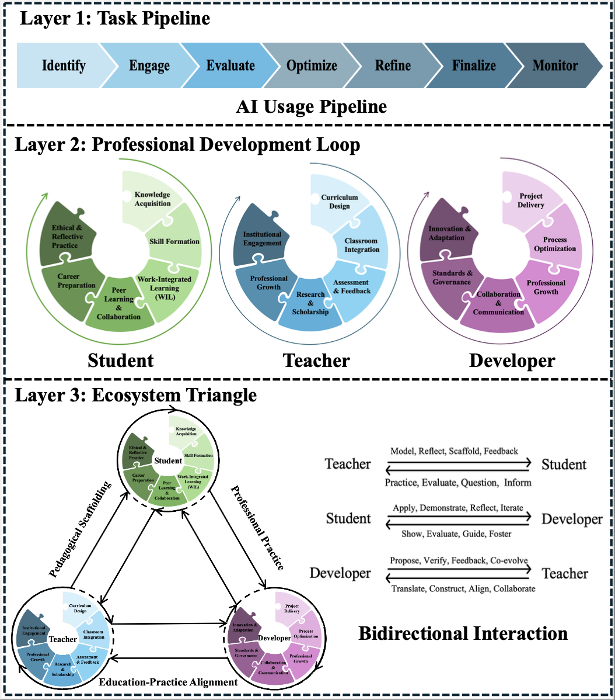

# Use Scenarios with Three-Layer Framework  

*Figure 1. Three-layer ecosystem framework for AI-enhanced software engineering education and professional practice.* [Download full PDF](THREE-LAYERS.pdf) 

As shown in Figure 1, **Layer 3** of the ecosystem framework focuses on cross-role interactions between teachers, students, and developers. Each relationship (Teacher–Student, Student–Developer, Teacher–Developer) is defined by a set of verbs that serve as operational indicators. 

These verbs can be used in **tick-box, Likert scale, or rubric-style assessments** to measure the effectiveness of AI-enhanced teaching, learning, and professional practice.

The following sections provide three concrete scenarios that illustrate how **teachers, students, and developers** interact within the proposed framework. Each scenario focuses on a specific domain of practice, showing how the verbs in **Layer 3 interactions** can be applied and evaluated in real contexts.  

- [1. Work-Integrated Learning (Student ↔ Developer)](#1-work-integrated-learning-wil-use-scenario-student--developer)  
- [2. Classroom Integration (Teacher ↔ Student)](#2-classroom-integration-use-scenario-teacher--student)  
- [3. Collaboration & Communication (Teacher ↔ Developer)](#3-collaboration--communication-use-scenario-teacher--developer)

---

## 1. Work-Integrated Learning (WIL) Use Scenario (Student ↔ Developer)
Work-Integrated Learning (WIL) provides a practical domain for applying the three-layer ecosystem framework. In this setting, students engage in authentic tasks that resemble professional workflows, while developers or mentors evaluate and support their performance.  

The evaluation focuses on **Layer 3 interactions** between students and developers. Each verb (e.g., *Apply, Demonstrate, Reflect, Iterate, Show, Evaluate, Guide, Foster*) serves as an observable indicator of how GenAI is used and scaffolded. 

---

### Student ↔ Developer Interaction Framework in WIL  

<table>
  <tr>
    <td><b>Interaction</b></td>
    <td><b>Phase (Verb)</b></td>
    <td><b>Observable Behavior</b></td>
  </tr>

  <tr>
    <td rowspan="4"><b>Student → Developer</b></td>
    <td><b>Apply</b></td>
    <td><i>Student:</i> Uses GenAI to generate solutions and integrate outputs into tasks.</td>
  </tr>
  <tr>
    <td><b>Demonstrate</b></td>
    <td><i>Student:</i> Presents GenAI-supported outputs (code, documentation, tests).</td>
  </tr>
  <tr>
    <td><b>Reflect</b></td>
    <td><i>Student:</i> Provides critical reflections on GenAI’s role, limits, and ethics.</td>
  </tr>
  <tr>
    <td><b>Iterate</b></td>
    <td><i>Student:</i> Revises GenAI use based on mentor feedback and refines outputs.</td>
  </tr>

  <tr>
    <td rowspan="4"><b>Developer → Student</b></td>
    <td><b>Show</b></td>
    <td><i>Developer:</i> Demonstrates real-world AI workflows, tools, and practices.</td>
  </tr>
  <tr>
    <td><b>Evaluate</b></td>
    <td><i>Developer:</i> Reviews student outputs against technical and ethical standards.</td>
  </tr>
  <tr>
    <td><b>Guide</b></td>
    <td><i>Developer:</i> Provides targeted advice on improving GenAI use and practices.</td>
  </tr>
  <tr>
    <td><b>Foster</b></td>
    <td><i>Developer:</i> Encourages sustainable, transferable GenAI practices for long-term growth.</td>
  </tr>
</table>

---
### Practical Application  

- **Students** are assessed not only on the correctness of outputs but also on *how* they integrate GenAI into their workflow (*Apply, Reflect, Demonstrate, Iterate*).  
- **Developers/Mentors** contribute by *Showing* authentic use cases, *Evaluating* student outputs, *Guiding* improvements, and *Fostering* responsible long-term practices.  
- This creates a **bidirectional loop** where student performance and developer mentorship can both be measured, ensuring that GenAI integration in WIL tasks is transparent, ethical, and transferable to industry contexts.  
---

### Evaluation with Tick-box Rubric  
This rubric illustrates how **Layer 3 verbs** can be operationalized into a practical evaluation of Student–Developer interactions in WIL tasks.  

#### Student Evaluation  

- **Apply**
  - [ ] Student integrates GenAI into the task workflow appropriately  
  - [ ] AI-generated outputs meet task requirements  
  - [ ] Outputs are documented with clear prompts and context  

- **Reflect**
  - [ ] Student provides critical reflection on GenAI’s role and limits  
  - [ ] Ethical implications are acknowledged  
  - [ ] Reflection links GenAI use to personal learning goals  

- **Demonstrate**
  - [ ] Student presents GenAI-supported outputs (code/docs/tests)  
  - [ ] Outputs are transparent and reproducible  
  - [ ] AI use is explicitly justified in the submission  

- **Iterate**
  - [ ] Student revises GenAI use based on mentor feedback  
  - [ ] Prompts or strategies show improvement  
  - [ ] Outputs demonstrate meaningful refinement  

#### Developer/Mentor Evaluation  

- **Show**
  - [ ] Demonstrates professional GenAI workflows in practice  
  - [ ] Highlights risks, compliance, and ethical standards  
  - [ ] Provides workplace-like examples (e.g., demos, case studies)  

- **Evaluate**
  - [ ] Reviews outputs against technical and ethical standards  
  - [ ] Assesses both process (prompts, iterations) and outcomes  
  - [ ] Uses consistent rubrics across students  

- **Guide**
  - [ ] Offers targeted advice on improving GenAI use  
  - [ ] Encourages deeper reasoning beyond tool outputs  
  - [ ] Suggests concrete strategies (prompting, debugging, workflow adaptation)  

- **Foster**
  - [ ] Reinforces sustainable GenAI practices for long-term growth  
  - [ ] Promotes balance between efficiency and deep learning  
  - [ ] Encourages independence and professional judgment alongside GenAI
        
---

## 2. Classroom Integration Use Scenario (Teacher ↔ Student)  

Classroom integration provides another domain for applying the three-layer ecosystem framework, especially in the design and use of teaching materials. In this setting, teachers structure GenAI use through instructional design, while students actively engage with AI-enhanced resources and activities.  

The evaluation focuses on **Layer 3 interactions** between teachers and students. Each verb (e.g., *Model, Reflect, Scaffold, Feedback, Practice, Evaluate, Question, Inform*) serves as an observable indicator of how GenAI is embedded in learning and teaching. 

---
### Teacher ↔ Student Interaction Framework in Classroom Integration  

<table>
  <tr>
    <td><b>Interaction</b></td>
     <td><b>Phase (Verb)</b></td>
     <td><b>Observable Behavior</b></td>
  </tr>
  <tr>
    <td rowspan="4"><b>Teacher → Student</b></td>
    <td><b>Model</b></td>
    <td><i>Teacher:</i> Demonstrates responsible GenAI use (e.g., generating teaching examples, prompts).</td>
  </tr>
  <tr>
    <td><b>Reflect</b></td>
    <td><i>Teacher:</i> Shares reflections on opportunities and risks of GenAI in teaching contexts.</td>
  </tr>
  <tr>
    <td><b>Scaffold</b></td>
    <td><i>Teacher:</i> Designs structured GenAI tasks, provides checkpoints and guiding resources.</td>
  </tr>
  <tr>
    <td><b>Feedback</b></td>
    <td><i>Teacher:</i> Gives formative feedback on how students apply GenAI in assignments.</td>
  </tr>

  <tr>
    <td rowspan="4"><b>Student → Teacher</b></td>
    <td><b>Practice</b></td>
    <td><i>Student:</i> Applies GenAI in guided tasks, experimenting with prompts and outputs.</td>
  </tr>
  <tr>
    <td><b>Evaluate</b></td>
    <td><i>Student:</i> Critically evaluates AI outputs against accuracy, relevance, and task goals.</td>
  </tr>
  <tr>
    <td><b>Question</b></td>
    <td><i>Student:</i> Raises questions about GenAI outputs, ethics, or limitations during class tasks.</td>
  </tr>
  <tr>
    <td><b>Inform</b></td>
    <td><i>Student:</i> Provides feedback on AI-integrated materials, informing future teaching design.</td>
  </tr>
</table>

---

### Practical Application  

- **Students** are evaluated on how effectively they *Practice* GenAI use, *Evaluate* outputs, *Question* assumptions, and *Inform* teachers about their learning experience.  
- **Teachers** operationalize integration by *Modeling* responsible practices, *Reflecting* on AI’s role, *Scaffolding* structured use cases, and *Providing Feedback*.  
- This creates a **bidirectional loop** in which students develop responsible, critical AI literacies, while teachers continuously refine teaching materials and strategies.  

---

### Evaluation with Tick-box Rubric  

#### Student Evaluation  

- **Practice**  
  - [ ] Student engages with GenAI tasks as instructed  
  - [ ] Outputs are aligned with task requirements  
  - [ ] Demonstrates attempts to improve prompt use  

- **Evaluate**  
  - [ ] Critically assesses AI outputs against accuracy and relevance  
  - [ ] Identifies limitations or errors in outputs  
  - [ ] Links evaluation to learning objectives  

- **Question**  
  - [ ] Raises questions about unclear or problematic AI outputs  
  - [ ] Engages in ethical or conceptual discussions about GenAI use  
  - [ ] Seeks clarification on GenAI’s role in the task  

- **Inform**  
  - [ ] Provides feedback on uthe sefulness of AI-integrated materials  
  - [ ] Suggests improvements for task design or guidance  
  - [ ] Reflects on how GenAI affects their learning process  

#### Teacher Evaluation  

- **Model**  
  - [ ] Demonstrates GenAI use with transparency and ethical awareness  
  - [ ] Explains rationale behind prompts and outputs  
  - [ ] Shows both strengths and weaknesses of GenAI  

- **Reflect**  
  - [ ] Shares pedagogical reflections on integrating GenAI  
  - [ ] Acknowledges risks such as overreliance or bias  
  - [ ] Connects GenAI use to broader learning goals  

- **Scaffold**  
  - [ ] Designs structured, stepwise activities integrating GenAI  
  - [ ] Provides checkpoints and resources to guide responsible use  
  - [ ] Ensures tasks encourage higher-order thinking, not shortcuts  

- **Feedback**  
  - [ ] Gives formative comments on student GenAI outputs and process  
  - [ ] Highlights effective practices and areas for improvement  
  - [ ] Reinforces responsible and ethical GenAI habits  

---

## 3.Collaboration & Communication Use Scenario (Teacher ↔ Developer)

Collaboration and communication form the backbone of aligning education with industry expectations. In this domain, developers articulate evolving workplace practices and skill requirements, while teachers adapt and refine curricula to prepare students accordingly. The interaction ensures that soft skills—such as teamwork, communication, and responsible AI use—are integrated into both teaching and professional workflows.  

The evaluation focuses on **Layer 3 interactions** between teachers and developers. Each verb (*Propose, Verify, Feedback, Co-evolve, Translate, Construct, Align, Collaborate*) serves as an observable indicator of how collaboration around GenAI practices is operationalized between academia and industry.  

---

### Teacher ↔ Developer Interaction Framework  

<table>
  <tr>
    <td><b>Interaction</b></td>
    <td><b>Phase (Verb)</b></td>
    <td><b>Observable Behavior</b></td>
  </tr>

  <tr>
    <td rowspan="4"><b>Developer → Teacher</b></td>
    <td><b>Propose</b></td>
    <td><i>Developer:</i> Suggests new GenAI-related practices, tools, or skills relevant to workplace needs.</td>
  </tr>
  <tr>
    <td><b>Verify</b></td>
    <td><i>Developer:</i> Reviews and validates whether course content reflects industry standards and workflows.</td>
  </tr>
  <tr>
    <td><b>Feedback</b></td>
    <td><i>Developer:</i> Provides structured feedback on curricula and teaching strategies with concrete examples.</td>
  </tr>
  <tr>
    <td><b>Co-evolve</b></td>
    <td><i>Developer:</i> Collaborates in long-term partnerships, co-developing case studies, modules, or projects.</td>
  </tr>

  <tr>
    <td rowspan="4"><b>Teacher → Developer</b></td>
    <td><b>Translate</b></td>
    <td><i>Teacher:</i> Translates industry requirements into teachable skills, learning outcomes, and GenAI-integrated tasks.</td>
  </tr>
  <tr>
    <td><b>Construct</b></td>
    <td><i>Teacher:</i> Builds structured curricula and assessments that integrate developer input into academic design.</td>
  </tr>
  <tr>
    <td><b>Align</b></td>
    <td><i>Teacher:</i> Ensures course outcomes align with evolving professional standards, especially AI-enhanced workflows.</td>
  </tr>
  <tr>
    <td><b>Collaborate</b></td>
    <td><i>Teacher:</i> Engages with developers in joint initiatives (guest lectures, advisory boards, shared projects).</td>
  </tr>
</table>

---

### Practical Application  

- **Developers** contribute workplace insights by *Proposing* emerging practices, *Verifying* content against standards, offering *Feedback*, and engaging in *Co-evolution* through long-term collaboration.  
- **Teachers** adapt by *Translating* professional needs into pedagogy, *Constructing* curricula with AI integration, *Aligning* learning outcomes with industry expectations, and *Collaborating* on shared initiatives.  
- This creates a **bidirectional loop** where workplace realities continuously inform teaching, while academic innovation contributes structured, ethical, and pedagogically sound approaches to GenAI-enhanced practice.  

---

### Evaluation with Tick-box Rubric  

#### Developer Evaluation  

- **Propose**
  - [ ] Developer introduces relevant GenAI use cases or practices  
  - [ ] Proposed practices are realistic and transferable to teaching contexts  
  - [ ] Contributions highlight both technical and ethical considerations  

- **Verify**
  - [ ] Developer reviews curriculum for alignment with current workflows  
  - [ ] Identifies gaps between academic outcomes and workplace needs  
  - [ ] Validates the practical relevance of AI-enhanced activities  

- **Feedback**
  - [ ] Developer provides actionable and specific curriculum suggestions  
  - [ ] Feedback is contextualized with workplace examples  
  - [ ] Feedback loop includes follow-up discussion with teachers  

- **Co-evolve**
  - [ ] Developer participates in ongoing collaborations (case studies, projects)  
  - [ ] Joint work results in sustainable teaching–industry links  
  - [ ] Evidence of iterative refinement over time  

#### Teacher Evaluation  

- **Translate**
  - [ ] Teacher converts workplace needs into clear learning outcomes  
  - [ ] GenAI practices are contextualized for student comprehension  
  - [ ] Translation preserves both technical and ethical dimensions  

- **Construct**
  - [ ] Teacher builds assignments or modules integrating developer input  
  - [ ] Materials scaffold AI-enhanced learning step by step  
  - [ ] Assessments measure both output and process  

- **Align**
  - [ ] Teacher revises outcomes to reflect evolving industry standards  
  - [ ] Explicit links between learning outcomes and workplace skills  
  - [ ] Curriculum includes AI-relevant collaboration and communication skills  

- **Collaborate**
  - [ ] Teacher involves developers in teaching activities (guest talks, reviews)  
  - [ ] Evidence of co-created resources or shared projects  
  - [ ] Collaboration produces measurable benefits for both parties  
